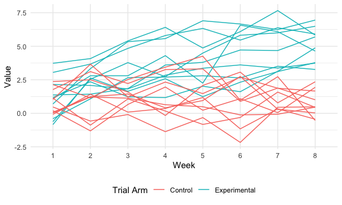

HW5
================

``` r
library(tidyverse)
library(p8105.datasets)
library(patchwork)

knitr::opts_chunk$set(
  fig.width = 6,
  fig.asp = .6,
  out.width = "90%"
)

theme_set(theme_minimal() + theme(legend.position = "bottom"))

options(
  ggplot2.continuous.colour = "viridis",
  ggplot2.continuous.fill = "viridis"
)

scale_colour_discrete = scale_colour_viridis_d
scale_fill_discrete = scale_fill_viridis_d
```

## Problem 1

``` r
homicide_df = 
  read_csv("data/homicide-data.csv", na = c("", "Unknown")) %>% 
  mutate(city_state = str_c(city, state), resolution = case_when(
    disposition == "Closed without arrest" ~ "unsolved", 
    disposition == "Open/No arrest" ~ "unsolved", 
    disposition == "Closed by arrest" ~ "solved")) %>% 
  relocate(city_state) %>% 
  filter(city_state != "TulsaAL")
```

Focusing on Baltimore, MD:

``` r
baltimiore_df = 
  homicide_df %>% 
  filter(city_state == "BaltimoreMD")

baltimore_summary = 
  baltimiore_df %>% 
  summarize(unsolved = sum(resolution == "unsolved"), 
            n = n())

baltimore_test = 
  prop.test(
    x = baltimore_summary %>% pull(unsolved), 
    n = baltimore_summary %>% pull(n))

baltimore_test %>% 
  broom::tidy()
```

    ## # A tibble: 1 × 8
    ##   estimate statistic  p.value parameter conf.low conf.high method    alternative
    ##      <dbl>     <dbl>    <dbl>     <int>    <dbl>     <dbl> <chr>     <chr>      
    ## 1    0.646      239. 6.46e-54         1    0.628     0.663 1-sample… two.sided

Getting the estimates across all cities

``` r
prop_test_function = function(city_df) {
  
  city_summary = 
  city_df %>% 
  summarize(unsolved = sum(resolution == "unsolved"), 
            n = n())

  city_test = 
    prop.test(
      x = city_summary %>% pull(unsolved), 
      n = city_summary %>% pull(n))

  return(city_test)
  
}

prop_test_function(baltimiore_df)
```

    ## 
    ##  1-sample proportions test with continuity correction
    ## 
    ## data:  city_summary %>% pull(unsolved) out of city_summary %>% pull(n), null probability 0.5
    ## X-squared = 239.01, df = 1, p-value < 2.2e-16
    ## alternative hypothesis: true p is not equal to 0.5
    ## 95 percent confidence interval:
    ##  0.6275625 0.6631599
    ## sample estimates:
    ##         p 
    ## 0.6455607

``` r
homicide_df %>% 
  filter(city_state == "AlbuquerqueNM") %>% 
  prop_test_function()
```

    ## 
    ##  1-sample proportions test with continuity correction
    ## 
    ## data:  city_summary %>% pull(unsolved) out of city_summary %>% pull(n), null probability 0.5
    ## X-squared = 19.114, df = 1, p-value = 1.232e-05
    ## alternative hypothesis: true p is not equal to 0.5
    ## 95 percent confidence interval:
    ##  0.3372604 0.4375766
    ## sample estimates:
    ##         p 
    ## 0.3862434

``` r
results_df = 
  homicide_df %>% 
  nest(data = uid:resolution) %>% 
  mutate(
    test_results = map(data, prop_test_function), 
    tidy_results = map(test_results, broom::tidy)
  ) %>% 
  select(city_state, tidy_results) %>% 
  unnest(tidy_results) %>% 
  select(city_state, estimate, starts_with("conf"))
```

Plot estimates and confidence intervals

``` r
results_df %>% 
  mutate(city_state = fct_reorder(city_state, estimate)) %>% 
  ggplot(aes(x = city_state, y = estimate)) + 
  geom_point() + 
  geom_errorbar(aes(ymin = conf.low, ymax = conf.high)) + 
  theme(axis.text.x = element_text(angle = 90, vjust = 0.5, hjust=1))
```


Other approach from office hours for reference:

``` r
homicide_df %>% 
  group_by(city_state) %>% 
  summarize(
    unsolved = sum(resolution == "unsolved"), 
    n = n()
  ) %>% 
  mutate(
    test_results = map2(unsolved, n, prop.test), 
    tidy_results = map(test_results, broom::tidy)
  ) %>% 
  select(city_state, tidy_results) %>% 
  unnest(tidy_results) %>% 
  select(city_state, estimate, starts_with("conf"))
```

    ## # A tibble: 50 × 4
    ##    city_state    estimate conf.low conf.high
    ##    <chr>            <dbl>    <dbl>     <dbl>
    ##  1 AlbuquerqueNM    0.386    0.337     0.438
    ##  2 AtlantaGA        0.383    0.353     0.415
    ##  3 BaltimoreMD      0.646    0.628     0.663
    ##  4 Baton RougeLA    0.462    0.414     0.511
    ##  5 BirminghamAL     0.434    0.399     0.469
    ##  6 BostonMA         0.505    0.465     0.545
    ##  7 BuffaloNY        0.612    0.569     0.654
    ##  8 CharlotteNC      0.300    0.266     0.336
    ##  9 ChicagoIL        0.736    0.724     0.747
    ## 10 CincinnatiOH     0.445    0.408     0.483
    ## # … with 40 more rows

## Problem 2

``` r
importcsv = function(filename) {
  
  x = str_c("data/data/", filename)
  data = read_csv(x)
  
  return(data)
}

importcsv("con_01.csv")
```

    ## # A tibble: 1 × 8
    ##   week_1 week_2 week_3 week_4 week_5 week_6 week_7 week_8
    ##    <dbl>  <dbl>  <dbl>  <dbl>  <dbl>  <dbl>  <dbl>  <dbl>
    ## 1    0.2  -1.31   0.66   1.96   0.23   1.09   0.05   1.94

``` r
prob2_df = 
  tibble(
  name = list.files("data/data/"), 
  data = map(name, importcsv))

full_data_2 = 
  prob2_df %>% 
    separate(name, c("treatment_arm", "id")) %>% 
  mutate(id = as.numeric(id), 
         treatment_arm = as.factor(treatment_arm)) %>% 
    unnest(data) %>% 
  pivot_longer(
    week_1:week_8, 
    names_to = "week", 
    names_prefix = "week_"
  ) %>% 
  mutate(id = ifelse(treatment_arm == "exp", id, id+10))

full_data_2 %>% 
  ggplot(aes(x = week, y = value, group = id, color = treatment_arm)) +
  geom_line() +
  labs(x = "Week", y = "Value") + 
  scale_color_discrete(name = "Trial Arm", labels = c("Control", "Experimental"))
```



Based on the spaghetti pot, it appears that those in the experimental
arm tend to have higher values than those in the control arm by the end
of week 8; however, values appeared much closer together at the
beginning of the trial period (meaning week 1). If the goal of the
treatment was to increase the values, it appears that the treatment was
effective.

## Problem 3

``` r
library(tidyverse)

set.seed(10)

iris_with_missing = iris %>% 
  map_df(~replace(.x, sample(1:150, 20), NA)) %>%
  mutate(Species = as.character(Species))
```

Function to fill in missing:

``` r
fill_missing = function(x) {
  
  if(is.character(x)) {
    
    x[is.na(x)] = "virginica"
  
    }
  
  if(is.numeric(x)) {
    
    x[is.na(x)] = mean(x, na.rm = TRUE)
    
  }
  
    if(!is.character(x) & !is.numeric(x)){
    stop("vector is not numeric or character")
  }
  
  
  return(x)
  
}

fill_missing(iris_with_missing$Sepal.Length)
```

    ##   [1] 5.100000 4.900000 4.700000 4.600000 5.000000 5.400000 5.819231 5.000000
    ##   [9] 4.400000 4.900000 5.400000 4.800000 5.819231 4.300000 5.819231 5.700000
    ##  [17] 5.400000 5.100000 5.700000 5.100000 5.400000 5.100000 4.600000 5.819231
    ##  [25] 4.800000 5.000000 5.000000 5.200000 5.819231 4.700000 4.800000 5.400000
    ##  [33] 5.200000 5.500000 4.900000 5.000000 5.500000 4.900000 4.400000 5.100000
    ##  [41] 5.000000 4.500000 4.400000 5.000000 5.100000 4.800000 5.100000 4.600000
    ##  [49] 5.300000 5.000000 7.000000 6.400000 6.900000 5.500000 6.500000 5.700000
    ##  [57] 6.300000 4.900000 6.600000 5.200000 5.000000 5.900000 6.000000 6.100000
    ##  [65] 5.600000 6.700000 5.600000 5.800000 6.200000 5.600000 5.900000 5.819231
    ##  [73] 6.300000 5.819231 6.400000 6.600000 6.800000 6.700000 6.000000 5.700000
    ##  [81] 5.500000 5.819231 5.800000 6.000000 5.400000 5.819231 6.700000 5.819231
    ##  [89] 5.600000 5.500000 5.500000 5.819231 5.800000 5.000000 5.819231 5.700000
    ##  [97] 5.700000 6.200000 5.100000 5.700000 6.300000 5.800000 7.100000 6.300000
    ## [105] 6.500000 7.600000 4.900000 7.300000 6.700000 5.819231 6.500000 5.819231
    ## [113] 6.800000 5.700000 5.800000 6.400000 6.500000 7.700000 7.700000 6.000000
    ## [121] 5.819231 5.600000 7.700000 6.300000 6.700000 7.200000 6.200000 6.100000
    ## [129] 6.400000 7.200000 7.400000 7.900000 6.400000 5.819231 6.100000 5.819231
    ## [137] 5.819231 6.400000 6.000000 6.900000 6.700000 6.900000 5.819231 6.800000
    ## [145] 6.700000 6.700000 6.300000 6.500000 5.819231 5.900000

``` r
fill_missing(iris_with_missing$Sepal.Width)
```

    ##   [1] 3.500000 3.000000 3.200000 3.100000 3.600000 3.900000 3.400000 3.400000
    ##   [9] 2.900000 3.100000 3.075385 3.400000 3.075385 3.000000 4.000000 4.400000
    ##  [17] 3.900000 3.500000 3.800000 3.800000 3.400000 3.700000 3.600000 3.300000
    ##  [25] 3.400000 3.000000 3.400000 3.500000 3.400000 3.200000 3.100000 3.075385
    ##  [33] 3.075385 4.200000 3.100000 3.200000 3.500000 3.600000 3.000000 3.400000
    ##  [41] 3.500000 3.075385 3.200000 3.500000 3.800000 3.000000 3.800000 3.200000
    ##  [49] 3.700000 3.075385 3.075385 3.200000 3.100000 2.300000 2.800000 2.800000
    ##  [57] 3.300000 2.400000 2.900000 2.700000 2.000000 3.000000 2.200000 2.900000
    ##  [65] 2.900000 3.100000 3.000000 3.075385 2.200000 2.500000 3.200000 2.800000
    ##  [73] 2.500000 2.800000 2.900000 3.000000 2.800000 3.075385 3.075385 2.600000
    ##  [81] 2.400000 2.400000 2.700000 2.700000 3.000000 3.400000 3.100000 3.075385
    ##  [89] 3.000000 2.500000 3.075385 3.075385 3.075385 2.300000 2.700000 3.000000
    ##  [97] 2.900000 2.900000 2.500000 2.800000 3.075385 2.700000 3.000000 2.900000
    ## [105] 3.075385 3.000000 2.500000 2.900000 3.075385 3.600000 3.200000 2.700000
    ## [113] 3.000000 3.075385 2.800000 3.200000 3.000000 3.800000 2.600000 2.200000
    ## [121] 3.200000 3.075385 2.800000 2.700000 3.300000 3.200000 2.800000 3.000000
    ## [129] 2.800000 3.000000 2.800000 3.800000 2.800000 2.800000 3.075385 3.000000
    ## [137] 3.400000 3.100000 3.000000 3.100000 3.100000 3.100000 2.700000 3.200000
    ## [145] 3.300000 3.000000 2.500000 3.000000 3.400000 3.000000

``` r
fill_missing(iris_with_missing$Petal.Length)
```

    ##   [1] 1.400000 1.400000 1.300000 1.500000 1.400000 1.700000 1.400000 1.500000
    ##   [9] 1.400000 3.765385 1.500000 1.600000 1.400000 3.765385 3.765385 1.500000
    ##  [17] 1.300000 1.400000 1.700000 1.500000 1.700000 1.500000 1.000000 3.765385
    ##  [25] 1.900000 3.765385 1.600000 1.500000 1.400000 1.600000 3.765385 1.500000
    ##  [33] 1.500000 1.400000 3.765385 1.200000 1.300000 1.400000 1.300000 1.500000
    ##  [41] 1.300000 1.300000 1.300000 1.600000 1.900000 1.400000 1.600000 3.765385
    ##  [49] 1.500000 1.400000 4.700000 4.500000 4.900000 4.000000 4.600000 4.500000
    ##  [57] 4.700000 3.765385 4.600000 3.900000 3.765385 4.200000 4.000000 4.700000
    ##  [65] 3.600000 4.400000 4.500000 4.100000 4.500000 3.900000 4.800000 4.000000
    ##  [73] 4.900000 3.765385 4.300000 4.400000 4.800000 5.000000 4.500000 3.500000
    ##  [81] 3.800000 3.700000 3.900000 5.100000 4.500000 4.500000 4.700000 4.400000
    ##  [89] 3.765385 4.000000 4.400000 4.600000 4.000000 3.300000 4.200000 4.200000
    ##  [97] 4.200000 4.300000 3.000000 4.100000 3.765385 5.100000 5.900000 5.600000
    ## [105] 5.800000 6.600000 4.500000 6.300000 3.765385 3.765385 5.100000 5.300000
    ## [113] 5.500000 5.000000 5.100000 5.300000 3.765385 6.700000 6.900000 5.000000
    ## [121] 5.700000 4.900000 6.700000 4.900000 5.700000 6.000000 4.800000 4.900000
    ## [129] 5.600000 5.800000 6.100000 3.765385 3.765385 5.100000 5.600000 6.100000
    ## [137] 5.600000 5.500000 4.800000 5.400000 5.600000 5.100000 5.100000 3.765385
    ## [145] 3.765385 5.200000 5.000000 5.200000 5.400000 5.100000

``` r
fill_missing(iris_with_missing$Petal.Width)
```

    ##   [1] 0.200000 0.200000 0.200000 1.192308 0.200000 0.400000 0.300000 0.200000
    ##   [9] 0.200000 0.100000 0.200000 0.200000 0.100000 0.100000 0.200000 0.400000
    ##  [17] 0.400000 1.192308 0.300000 1.192308 0.200000 0.400000 0.200000 0.500000
    ##  [25] 0.200000 0.200000 0.400000 0.200000 0.200000 0.200000 0.200000 0.400000
    ##  [33] 0.100000 0.200000 0.200000 0.200000 0.200000 0.100000 1.192308 0.200000
    ##  [41] 0.300000 1.192308 0.200000 0.600000 0.400000 0.300000 0.200000 0.200000
    ##  [49] 0.200000 0.200000 1.400000 1.500000 1.500000 1.300000 1.500000 1.300000
    ##  [57] 1.600000 1.000000 1.300000 1.400000 1.000000 1.500000 1.192308 1.400000
    ##  [65] 1.300000 1.400000 1.500000 1.000000 1.500000 1.100000 1.800000 1.300000
    ##  [73] 1.500000 1.200000 1.300000 1.400000 1.400000 1.192308 1.192308 1.000000
    ##  [81] 1.100000 1.000000 1.200000 1.600000 1.500000 1.600000 1.192308 1.300000
    ##  [89] 1.192308 1.192308 1.200000 1.192308 1.192308 1.192308 1.300000 1.200000
    ##  [97] 1.300000 1.300000 1.192308 1.300000 2.500000 1.900000 2.100000 1.800000
    ## [105] 2.200000 2.100000 1.700000 1.800000 1.800000 2.500000 2.000000 1.900000
    ## [113] 2.100000 2.000000 2.400000 2.300000 1.800000 1.192308 2.300000 1.500000
    ## [121] 1.192308 2.000000 2.000000 1.800000 2.100000 1.800000 1.800000 1.800000
    ## [129] 2.100000 1.600000 1.192308 2.000000 2.200000 1.500000 1.400000 2.300000
    ## [137] 1.192308 1.192308 1.800000 2.100000 2.400000 2.300000 1.900000 2.300000
    ## [145] 2.500000 2.300000 1.900000 2.000000 2.300000 1.800000

``` r
fill_missing(iris_with_missing$Species)
```

    ##   [1] "setosa"     "setosa"     "setosa"     "setosa"     "setosa"    
    ##   [6] "setosa"     "setosa"     "setosa"     "setosa"     "setosa"    
    ##  [11] "setosa"     "setosa"     "setosa"     "setosa"     "setosa"    
    ##  [16] "setosa"     "setosa"     "setosa"     "setosa"     "setosa"    
    ##  [21] "setosa"     "virginica"  "setosa"     "setosa"     "virginica" 
    ##  [26] "setosa"     "virginica"  "setosa"     "setosa"     "setosa"    
    ##  [31] "setosa"     "setosa"     "setosa"     "setosa"     "setosa"    
    ##  [36] "setosa"     "setosa"     "setosa"     "setosa"     "setosa"    
    ##  [41] "setosa"     "virginica"  "setosa"     "setosa"     "setosa"    
    ##  [46] "virginica"  "setosa"     "setosa"     "setosa"     "setosa"    
    ##  [51] "virginica"  "versicolor" "versicolor" "versicolor" "versicolor"
    ##  [56] "versicolor" "virginica"  "versicolor" "virginica"  "versicolor"
    ##  [61] "versicolor" "versicolor" "versicolor" "versicolor" "versicolor"
    ##  [66] "versicolor" "versicolor" "versicolor" "versicolor" "versicolor"
    ##  [71] "versicolor" "virginica"  "versicolor" "versicolor" "versicolor"
    ##  [76] "versicolor" "versicolor" "versicolor" "versicolor" "virginica" 
    ##  [81] "versicolor" "versicolor" "versicolor" "versicolor" "versicolor"
    ##  [86] "versicolor" "versicolor" "versicolor" "versicolor" "versicolor"
    ##  [91] "versicolor" "versicolor" "versicolor" "virginica"  "versicolor"
    ##  [96] "versicolor" "versicolor" "versicolor" "versicolor" "virginica" 
    ## [101] "virginica"  "virginica"  "virginica"  "virginica"  "virginica" 
    ## [106] "virginica"  "virginica"  "virginica"  "virginica"  "virginica" 
    ## [111] "virginica"  "virginica"  "virginica"  "virginica"  "virginica" 
    ## [116] "virginica"  "virginica"  "virginica"  "virginica"  "virginica" 
    ## [121] "virginica"  "virginica"  "virginica"  "virginica"  "virginica" 
    ## [126] "virginica"  "virginica"  "virginica"  "virginica"  "virginica" 
    ## [131] "virginica"  "virginica"  "virginica"  "virginica"  "virginica" 
    ## [136] "virginica"  "virginica"  "virginica"  "virginica"  "virginica" 
    ## [141] "virginica"  "virginica"  "virginica"  "virginica"  "virginica" 
    ## [146] "virginica"  "virginica"  "virginica"  "virginica"  "virginica"

``` r
iris_filled = 
  iris_with_missing %>% 
  map_df(fill_missing) 

sum(is.na(iris_with_missing$Sepal.Length))
```

    ## [1] 20

``` r
sum(is.na(iris_filled$Sepal.Length))
```

    ## [1] 0

``` r
sum(is.na(iris_with_missing$Sepal.Width))
```

    ## [1] 20

``` r
sum(is.na(iris_filled$Sepal.Width))
```

    ## [1] 0

``` r
sum(is.na(iris_with_missing$Petal.Length))
```

    ## [1] 20

``` r
sum(is.na(iris_filled$Petal.Length))
```

    ## [1] 0

``` r
sum(is.na(iris_with_missing$Petal.Width))
```

    ## [1] 20

``` r
sum(is.na(iris_filled$Petal.Width))
```

    ## [1] 0

``` r
sum(is.na(iris_with_missing$Species))
```

    ## [1] 20

``` r
sum(is.na(iris_filled$Species))
```

    ## [1] 0
